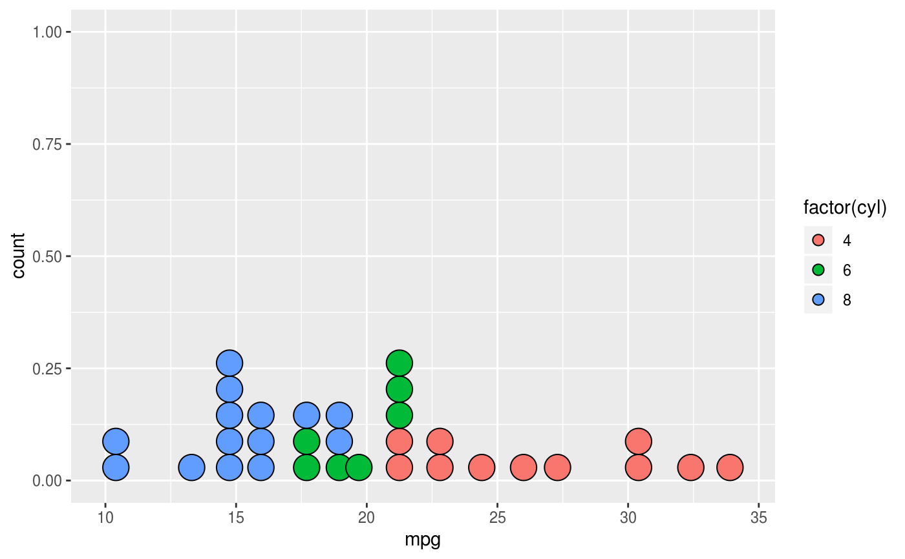

# Production of methane during CHO metabolism

## Introduction

adskhfaskdhfkasdhfkasdhfhfadskhfaskdhfkasdhfkasdhfhfadskhfaskdhfkasdhfkasdhfhfadskhfaskdhfkasdhfkasdhfhfadskhfaskdhfkasdhfkasdhfhfadskhfaskdhfkasdhfkasdhfhfadskhfaskdhfkasdhfkasdhfhfadskhfaskdhfkasdhfkasdhfhf

### This is a link to an external source

[Methane production](https://letstalkscience.ca/educational-resources/stem-in-context/cows-methane-and-climate-change)

### This is a link to a file in the same repo

[Homepage](index.html)

### Here we will insert a sample image

#### Materials and Methods

adskhfaskdhfkasdhfkasdhfhfadskhfaskdhfkasdhfkasdhfhfadskhfaskdhfkasdhfkasdhfhfadskhfaskdhfkasdhfkasdhfhfadskhfaskdhfkasdhfkasdhfhfadskhfaskdhfkasdhfkasdhfhfadskhfaskdhfkasdhfkasdhfhfadskhfaskdhfkasdhfkasdhfhf

adskhfaskdhfkasdhfkasdhfhfadskhfaskdhfkasdhfkasdhfhfadskhfaskdhfkasdhfkasdhfhfadskhfaskdhfkasdhfkasdhfhfadskhfaskdhfkasdhfkasdhfhfadskhfaskdhfkasdhfkasdhfhfadskhfaskdhfkasdhfkasdhfhfadskhfaskdhfkasdhfkasdhfhf
adskhfaskdhfkasdhfkasdhfhfadskhfaskdhfkasdhfkasdhfhfadskhfaskdhfkasdhfkasdhfhfadskhfaskdhfkasdhfkasdhfhfadskhfaskdhfkasdhfkasdhfhfadskhfaskdhfkasdhfkasdhfhfadskhfaskdhfkasdhfkasdhfhfadskhfaskdhfkasdhfkasdhfhf
adskhfaskdhfkasdhfkasdhfhfadskhfaskdhfkasdhfkasdhfhfadskhfaskdhfkasdhfkasdhfhfadskhfaskdhfkasdhfkasdhfhfadskhfaskdhfkasdhfkasdhfhfadskhfaskdhfkasdhfkasdhfhfadskhfaskdhfkasdhfkasdhfhfadskhfaskdhfkasdhfkasdhfhf
adskhfaskdhfkasdhfkasdhfhfadskhfaskdhfkasdhfkasdhfhfadskhfaskdhfkasdhfkasdhfhfadskhfaskdhfkasdhfkasdhfhfadskhfaskdhfkasdhfkasdhfhfadskhfaskdhfkasdhfkasdhfhfadskhfaskdhfkasdhfkasdhfhfadskhfaskdhfkasdhfkasdhfhf
adskhfaskdhfkasdhfkasdhfhfadskhfaskdhfkasdhfkasdhfhfadskhfaskdhfkasdhfkasdhfhfadskhfaskdhfkasdhfkasdhfhfadskhfaskdhfkasdhfkasdhfhfadskhfaskdhfkasdhfkasdhfhfadskhfaskdhfkasdhfkasdhfhfadskhfaskdhfkasdhfkasdhfhf
adskhfaskdhfkasdhfkasdhfhfadskhfaskdhfkasdhfkasdhfhfadskhfaskdhfkasdhfkasdhfhfadskhfaskdhfkasdhfkasdhfhfadskhfaskdhfkasdhfkasdhfhfadskhfaskdhfkasdhfkasdhfhfadskhfaskdhfkasdhfkasdhfhfadskhfaskdhfkasdhfkasdhfhf

[M&M](#materials-and-methods)

__Table 1.__ Production of methane per country. 

| Country  | Continent | Methane in kg |
|----------|-----------|----------------|
| Canada   | America   | 40             |
| Germany  | Europe    | 40             |